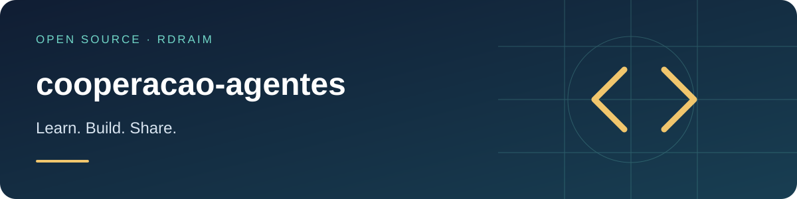

<p align="right">
  <a href="README.md"></a>
  <a href="README.en-US.md"></a>
  <a href="README.es-AR.md"></a>
</p>

# cooperacao-agentes



<!-- public-badges:start -->
[](LICENSE) [](https://github.com/Rdraim/cooperacao-agentes/actions) [](https://github.com/Rdraim/cooperacao-agentes/releases)
<!-- public-badges:end -->

<p>
  <a href="https://github.com/Rdraim/cooperacao-agentes/tree/main/examples"></a>
  <a href="https://github.dev/Rdraim/cooperacao-agentes"></a>
  <a href="https://github.com/Rdraim/cooperacao-agentes/archive/refs/heads/main.zip"></a>
</p>


A **method** (and a small tool) for several agents — AI or people — to collaborate through the **same Git repository** without stepping on each other. The repo is the shared memory; each task leaves a short **handoff note** ("passagem"). It is not an autonomous orchestrator: it is reviewable discipline.

Teaching material for anyone starting with agent cooperation. The examples are synthetic; nothing here depends on a specific platform.

## Principles

1. **The repo is the memory.** The context window is working memory; whatever must last goes into Git — code, docs or a handoff note.
2. **Evidence, not assumption.** Old docs are history, not proof the behavior still holds. Check the real state before editing.
3. **Split and record scope.** Divide by problem/area. Cross-area dependencies are recorded with the contract and expected behavior.
4. **Preserve the other's work.** Re-read the real state before touching a file another agent changed; adapt on top, never clobber.
5. **Don't speak for others.** Don't claim another agent's review, agreement or test without evidence.

## Before working

1. Read the repo instructions and the handoff note for the topic.
2. Check Git and local changes.
3. Create a note `passagens/YYYY-MM-DD-topic-agent.md` (one file per task, to reduce write conflicts).
4. If another note signals work on the same files, check activity first. An old note doesn't prove the agent is still active.

## While working

- Update the note when scope changes, a step completes, you hit a blocker, or before an interruption — not only at the end.
- Also record changes that **don't show in the diff** (database, config, content): state the target, the effect and how to verify — no secrets.
- Code comments explain non-obvious rules; they are not a chat transcript. Lasting decisions go into `decisions/`.

## Coordinated publishing

When publishing rebuilds/restarts the whole repository state (not just your change), publishing is a shared act and deserves a simple, by-convention lock:

1. **Dirty tree?** Uncommitted work may be another agent's in progress — don't publish.
2. **Any note with `Estado: em andamento` (in progress)?** Someone may be active — don't publish.

If nobody is working (clean tree, no in-progress note), publish everything at once, already integrated, and confirm the health of what went live.

## The handoff note

```text
# Task subject

Data e agente:            (date and agent)
Estado:                   em andamento | concluido | interrompido | bloqueado
Objetivo e autorizacao:   (goal and authorization)
Arquivos/areas em trabalho:
Mudancas realizadas e motivo:
Alteracoes fora do versionamento (banco, config, conteudo):
Verificacoes e resultados:
Nao verificado / limites:
Estado do servico / publicacao:
Proximo passo concreto:
Referencias:
```

(The field labels are kept in Portuguese so the validator matches a single canonical format.)

## Tool

The module checks that a note has the minimum sections and a recognized state:

```js
import { validarPassagem, MODELO } from './src/passagem.js';

const r = validarPassagem(text);
// { ok, titulo, estado, faltando: [...], avisos: [...] }
```

| export | description |
|---|---|
| `MODELO` | the template above, ready to copy |
| `CAMPOS` / `ESTADOS` | minimum sections and recognized states |
| `analisarPassagem(text)` | `{ titulo, campos, estado }` |
| `validarPassagem(text)` | `{ ok, titulo, estado, faltando, avisos }` |

## Limitations

- It is **convention and a check**, not automation: it neither locks edits nor notifies anyone.
- Validation looks at structure (sections and state), not content quality.
- Works with any AI tool or human flow; assumes no platform.

## Tests

```bash
node --test
```

## License

MIT © Rodrigo Rodrigues

## ☕ Buy me a coffee

Did this project help you solve a problem, learn something new, or take your first steps in development? If you feel like supporting my work, a coffee is a kind way to say thank you.

I’m **Rodrigo Rodrigues**, creator of **Nexus** and these open source projects. Your support helps me set aside time to improve the code, write clearer examples, and keep sharing what I learn.

**Give any amount that feels right to you. Supporting is completely optional — the project remains free under the MIT license.**

<p>
  <a href="#support-via-pix"></a>
  <a href="https://github.com/Rdraim/cooperacao-agentes/issues/new?title=Feedback%3A%20this%20project%20helped%20me"></a>
</p>

### Support via Pix

In your banking app, scan the QR code or copy the Pix key below. Choose your amount and check the recipient details before confirming.

<p align="center">
  
</p>

**Pix key**

```text
8875a24e-44d1-4c91-b6bb-62c9f0070955
```

Pix is Brazil’s payment system. If your bank does not support it, you can still help by sharing the project, reporting a bug, improving the documentation, or leaving feedback.

### Your feedback matters, too

[Tell me how the project helped you](https://github.com/Rdraim/cooperacao-agentes/issues/new?title=Feedback%3A%20this%20project%20helped%20me). I’d love to hear what you built, what you learned, and what could be clearer for someone just starting out.

A comment is welcome with or without a donation. Please keep payment receipts, personal details, credentials and private user data out of public Issues.

---

**Thank you for supporting my work and helping me keep building and sharing. ❤️**
