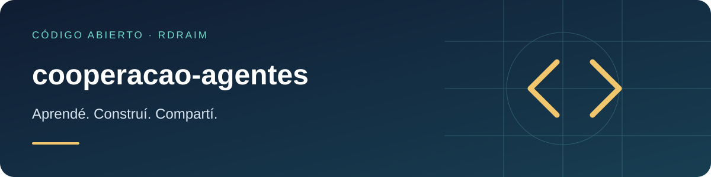

<p align="right">
  <a href="README.md"></a>
  <a href="README.en-US.md"></a>
  <a href="README.es-AR.md"></a>
</p>

# cooperacao-agentes



<!-- public-badges:start -->
[](LICENSE) [](https://github.com/Rdraim/cooperacao-agentes/actions) [](https://github.com/Rdraim/cooperacao-agentes/releases)
<!-- public-badges:end -->

<p>
  <a href="https://github.com/Rdraim/cooperacao-agentes/tree/main/examples"></a>
  <a href="https://github.dev/Rdraim/cooperacao-agentes"></a>
  <a href="https://github.com/Rdraim/cooperacao-agentes/archive/refs/heads/main.zip"></a>
</p>


Un **método** (y una pequeña herramienta) para que varios agentes — de IA o personas — colaboren por el **mismo repositorio Git** sin pisarse. El repo es la memoria común; cada tarea deja una **passagem** (handoff) corta. No es un orquestador autónomo: es disciplina revisable.

Material didáctico para quien arranca con cooperación entre agentes. Los ejemplos son sintéticos; nada acá depende de una plataforma específica.

## Principios

1. **El repo es la memoria.** La ventana de contexto es memoria de trabajo; lo que debe durar va al Git — código, documento o passagem.
2. **Evidencia, no suposición.** La documentación vieja es historia, no prueba de que el comportamiento siga igual. Verificá el estado real antes de editar.
3. **Dividir y registrar el alcance.** Dividí por problema/área. Las dependencias entre áreas se registran con el contrato y el comportamiento esperado.
4. **Preservá el trabajo del otro.** Releé el estado real antes de tocar un archivo que otro agente cambió; adaptá por encima, sin sobrescribir.
5. **No hables por otros.** No afirmes revisión, acuerdo o prueba de otro agente sin evidencia.

## Antes de trabajar

1. Leé las instrucciones del repo y la passagem del tema.
2. Verificá el Git y los cambios locales.
3. Creá un registro `passagens/AAAA-MM-DD-tema-agente.md` (un archivo por tarea, para reducir conflictos de escritura).
4. Si otro registro indica trabajo en los mismos archivos, verificá la actividad primero. Un registro viejo no prueba que el agente siga activo.

## Durante el trabajo

- Actualizá la passagem al cambiar el alcance, completar una etapa, encontrar un bloqueo o antes de una interrupción — no solo al final.
- Registrá también los cambios que **no aparecen en el diff** (base, configuración, contenido): indicá el destino, el efecto y cómo verificar — sin secretos.
- Los comentarios del código explican reglas no obvias; no son transcripción de charla. Las decisiones duraderas van a `decisions/`.

## Publicación coordinada

Cuando publicar reconstruye/reinicia el estado completo del repositorio (no solo tu cambio), publicar es un acto compartido y merece una traba simple, por convención:

1. **¿Árbol sucio?** Un cambio sin commit puede ser trabajo de otro agente en curso — no publiques.
2. **¿Alguna passagem con `Estado: em andamento`?** Entonces alguien puede estar activo — no publiques.

Si nadie está trabajando (árbol limpio, ninguna passagem en curso), publicá todo de una vez, ya integrado, y confirmá la salud de lo que subió.

## La passagem (handoff)

```text
# Asunto de la tarea

Data e agente:
Estado: em andamento | concluido | interrompido | bloqueado
Objetivo e autorizacao:
Arquivos/areas em trabalho:
Mudancas realizadas e motivo:
Alteracoes fora do versionamento (banco, config, conteudo):
Verificacoes e resultados:
Nao verificado / limites:
Estado do servico / publicacao:
Proximo passo concreto:
Referencias:
```

(Las etiquetas se mantienen en portugués para que el validador use un único formato canónico.)

## Herramienta

El módulo valida que una passagem tenga las secciones mínimas y un estado reconocido:

```js
import { validarPassagem, MODELO } from './src/passagem.js';

const r = validarPassagem(texto);
// { ok, titulo, estado, faltando: [...], avisos: [...] }
```

| export | descripción |
|---|---|
| `MODELO` | la plantilla de arriba, lista para copiar |
| `CAMPOS` / `ESTADOS` | secciones mínimas y estados reconocidos |
| `analisarPassagem(texto)` | `{ titulo, campos, estado }` |
| `validarPassagem(texto)` | `{ ok, titulo, estado, faltando, avisos }` |

## Limitaciones

- Es **convención y chequeo**, no automatización: no traba ediciones ni notifica a nadie.
- La validación mira la estructura (secciones y estado), no la calidad del contenido.
- Sirve a cualquier herramienta de IA o flujo humano; no presume plataforma.

## Tests

```bash
node --test
```

## Licencia

MIT © Rodrigo Rodrigues

## ☕ Invitame un café

¿Este proyecto te ayudó a resolver un problema, aprender algo nuevo o dar tus primeros pasos en desarrollo? Si querés apoyar mi trabajo, un café es una linda forma de agradecer.

Soy **Rodrigo Rodrigues**, creador de **Nexus** y de estos proyectos de código abierto. Tu aporte me ayuda a dedicar tiempo a mejorar el código, escribir ejemplos más claros y seguir compartiendo lo que aprendo.

**Aportá el monto que tenga sentido para vos. El apoyo es totalmente voluntario; el proyecto sigue siendo gratuito bajo la licencia MIT.**

[Apoyá con Pix](#apoyá-con-pix) · [Dejá un comentario](https://github.com/Rdraim/cooperacao-agentes/issues/new?title=Comentario%3A%20este%20proyecto%20me%20ayud%C3%B3)

### Apoyá con Pix

En la app de tu banco, escaneá el QR o copiá la clave Pix de abajo. Elegí el monto y revisá los datos del destinatario antes de confirmar.

<p align="center">
  
</p>

**Clave Pix**

```text
8875a24e-44d1-4c91-b6bb-62c9f0070955
```

Pix es el sistema de pagos de Brasil. Si tu banco no lo admite, también podés ayudar compartiendo el proyecto, reportando un problema, mejorando la documentación o dejando un comentario.

### Tu comentario también suma

[Contame cómo te ayudó el proyecto](https://github.com/Rdraim/cooperacao-agentes/issues/new?title=Comentario%3A%20este%20proyecto%20me%20ayud%C3%B3). Me gustaría saber qué creaste, qué aprendiste y qué podría ser más claro para quienes recién empiezan.

Los comentarios son bienvenidos con o sin donación. Cuidá tu privacidad: no publiques comprobantes de pago, datos personales, credenciales ni información privada de usuarios en las Issues.

**Gracias por apoyar mi trabajo y ayudarme a seguir creando y compartiendo. ❤️**
