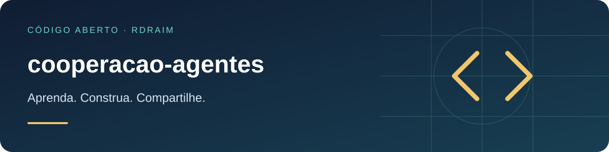

<p align="right">
  <a href="README.md"></a>
  <a href="README.en-US.md"></a>
  <a href="README.es-AR.md"></a>
</p>

# cooperacao-agentes



[](LICENSE) [](https://github.com/Rdraim/cooperacao-agentes/actions) [](https://github.com/Rdraim/cooperacao-agentes/releases) [](https://github.com/Rdraim/cooperacao-agentes/commits/main) [](https://github.com/Rdraim/cooperacao-agentes/stargazers) [](https://github.com/Rdraim/cooperacao-agentes/forks)

<p>
  <a href="https://github.com/Rdraim/cooperacao-agentes/tree/main/examples"></a>
  <a href="https://github.dev/Rdraim/cooperacao-agentes"></a>
  <a href="https://github.com/Rdraim/cooperacao-agentes/archive/refs/heads/main.zip"></a>
</p>


Um **método** (e uma pequena ferramenta) para vários agentes — de IA ou pessoas — colaborarem pelo **mesmo repositório Git** sem se atropelar. O repositório é a memória comum; cada tarefa deixa uma **passagem** (handoff) curta. Não é um orquestrador autônomo: é disciplina revisável.

Material didático para quem está começando em cooperação entre agentes. Os exemplos são sintéticos; nada aqui depende de uma plataforma específica.

## Princípios

1. **O repositório é a memória.** A janela de contexto é a memória de trabalho; o que precisa durar vai para o Git — código, documento ou passagem.
2. **Evidência, não suposição.** Documentação antiga é histórico, não prova de que o comportamento continua igual. Confira o estado real antes de editar.
3. **Escopo dividido e registrado.** Divida por problema/área. Dependência entre áreas se registra com o contrato e o comportamento esperado.
4. **Preserve o trabalho do outro.** Releia o estado real antes de mexer num arquivo que outro agente tocou; adapte por cima, sem sobrescrever.
5. **Não declare por outro.** Não afirme revisão, concordância ou teste de outro agente sem evidência.

## Antes de trabalhar

1. Leia as instruções do repositório e a passagem relacionada ao assunto.
2. Confira o Git e as alterações locais.
3. Crie um registro `passagens/AAAA-MM-DD-assunto-agente.md` (um arquivo por tarefa, para reduzir conflito de escrita).
4. Se outro registro indica trabalho nos mesmos arquivos, confira a atividade antes de editar. Um registro antigo não prova que o agente ainda está ativo.

## Durante o trabalho

- Atualize a passagem ao mudar escopo, concluir uma etapa, encontrar bloqueio ou antes de uma interrupção — não só no fim.
- Registre também alterações que **não aparecem no diff** (banco, configuração, conteúdo): diga o destino, o efeito e como conferir — sem segredos.
- Comentários no código explicam regras não óbvias; não são transcrição de conversa. Decisões duradouras vão para `decisions/`.

## Publicação coordenada

Quando publicar reconstrói/reinicia o estado inteiro do repositório (não só a sua mudança), a publicação é um ato compartilhado e merece uma trava simples, por convenção:

1. **Árvore suja?** Mudança não commitada pode ser trabalho de outro agente em andamento — não publique.
2. **Alguma passagem com `Estado: em andamento`?** Então alguém pode estar ativo — não publique.

Se ninguém estiver trabalhando (árvore limpa, nenhuma passagem em andamento), publique tudo de uma vez, já integrado, e confirme a saúde do que subiu.

## A passagem (handoff)

```text
# Assunto da tarefa

Data e agente:
Estado: em andamento | concluido | interrompido | bloqueado
Objetivo e autorizacao:
Arquivos/areas em trabalho:
Mudancas realizadas e motivo:
Alteracoes fora do versionamento (banco, config, conteudo):
Verificacoes e resultados:
Nao verificado / limites:
Estado do servico / publicacao:
Proximo passo concreto:
Referencias:
```

## Ferramenta

O módulo valida que uma passagem tem as seções mínimas e um estado reconhecido:

```js
import { validarPassagem, MODELO } from './src/passagem.js';

const r = validarPassagem(texto);
// { ok, titulo, estado, faltando: [...], avisos: [...] }
```

| export | descrição |
|---|---|
| `MODELO` | o gabarito acima, pronto para copiar |
| `CAMPOS` / `ESTADOS` | seções mínimas e estados reconhecidos |
| `analisarPassagem(texto)` | `{ titulo, campos, estado }` |
| `validarPassagem(texto)` | `{ ok, titulo, estado, faltando, avisos }` |

## Limitações

- É **convenção e checagem**, não automação: não trava edição nem notifica ninguém.
- A validação olha estrutura (seções e estado), não a qualidade do conteúdo.
- Serve a qualquer ferramenta de IA ou fluxo humano; não presume plataforma.

## Testes

```bash
node --test
```

## Licença

MIT © Rodrigo Rodrigues

## ☕ Me pague um café

Este projeto te ajudou a resolver um problema, aprender algo novo ou dar os primeiros passos no desenvolvimento? Se você sentir vontade de apoiar meu trabalho, um café é uma forma carinhosa de agradecer.

Sou **Rodrigo Rodrigues**, criador do **Nexus** e destes projetos de código aberto. Seu apoio me ajuda a dedicar tempo para melhorar o código, escrever exemplos mais claros e continuar compartilhando o que aprendo.

**Contribua com o valor que fizer sentido para você. O apoio é totalmente voluntário — o projeto continua gratuito sob a licença MIT.**

<p>
  <a href="#apoie-com-pix"></a>
  <a href="https://github.com/Rdraim/cooperacao-agentes/issues/new?title=Coment%C3%A1rio%3A%20este%20projeto%20me%20ajudou"></a>
</p>

### Apoie com Pix

No aplicativo do seu banco, escaneie o QR Code ou copie a chave Pix abaixo. Escolha o valor e confira os dados do destinatário antes de confirmar.

<p align="center">
  
</p>

**Chave Pix**

```text
8875a24e-44d1-4c91-b6bb-62c9f0070955
```

Você também pode apoiar compartilhando o projeto, relatando um problema, melhorando a documentação ou deixando um comentário.

### Seu comentário também faz diferença

[Conte como o projeto te ajudou](https://github.com/Rdraim/cooperacao-agentes/issues/new?title=Coment%C3%A1rio%3A%20este%20projeto%20me%20ajudou). Vou gostar de saber o que você criou, o que aprendeu e o que poderia ficar mais claro para quem está começando.

O comentário é bem-vindo com ou sem doação. Preserve sua privacidade: não publique comprovantes, dados pessoais, credenciais ou informações de usuários nas Issues.

---

**Obrigado por apoiar meu trabalho e me ajudar a continuar criando e compartilhando. ❤️**
